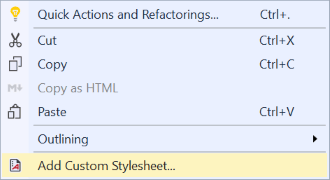

# 블로그 시작
블로그를 시작 합니다.


```javascript
(() => console.log('Hello, World!'))();
```

```csharp
for (int i = 0 ; i < 10; i++)
{
    // Code to execute.
}

Console.WriteLine("Fenced code blocks ftw!");

for (int i = 0 ; i < 10; i++)
{
    // Code to execute.
}

```


https://kichul1122.github.io/





```csharp
public class Apple
{
    public Attack()
    {
    
    }
}
```
...


**안되넹...**

*ㅁㄴㅇㄹ*

`오.. 이게 대박이네`

[# 블로그 시작2](http://example.com)


 - ㄴ아아아아
 - 아아아아아아ㅏㅇ

---
